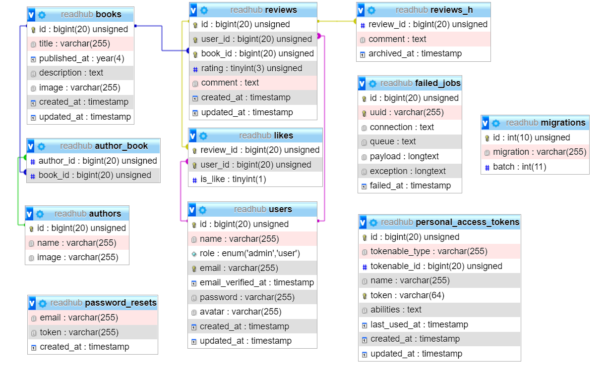

# ReadHub

Book review and rating Backend API built using ***Laravel***

## Features

This application has three types of roles:- 
- Admin
- User
- Guest
  
#### All roles can:-
1- Read books  
2- Read reviews  
3- Read likes and dislikes of a review  
4- Read the updating history of the comment of a review
   
#### Guests can:-
1- Sign-up or sign-in with email and password  
2- Sign-up or sign-in with Google account  
 
#### Authenticated accounts can:-
1- Update information and password  
2- Logout  
3- Delete the account  
 

#### Admins can:-
1- Create, read, update, and delete authors  
2- Create, read, update, and delete books  
3- Delete users  
4- Delete reviews  
 
#### Users can:-
1- Review a book  
2- Update and delete their review  
3- Like or dislike a review  
 

## Entity relationship diagram

## Packages

[Laravel Sanctum](https://laravel.com/docs/8.x/sanctum)  
[Laravel Socialite](https://laravel.com/docs/8.x/socialite)  

## License

[MIT license](https://opensource.org/licenses/MIT).
